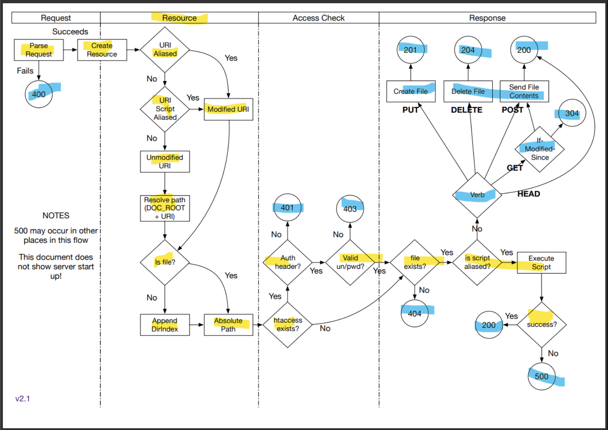

# web-server

## Milestones / Specifications

- [ ] 1. Read, and store, standard configuration files for use in responding to client requests - AC
- [ ] 2. Parse HTTP Requests - AC
- [ ] 3. Generate and send HTTP Responses (this involves many possible code paths, and is probably the most significant implementation step) - MS
- [ ] 4. Respond to multiple simultaneous requests through the use of threads - AC
- [ ] 5. Execute server side processes to handle server side scripts - AC
- [ ] 6. Support simple authentication - AC
- [ ] 7. Support simple caching - MS
- [ ] 8. Logging - MS

## Server Workflow



## Run

```
// TODO: Simplify to javac WebServer.java;java WebServer
javac server/config/MimeTypes.java; javac server/config/HttpdConfig.java;javac server/config/Htpassword.java; javac public_html/RunScript.java;javac server/config/Configuration.java;javac server/config/HtAccess.java;javac server/Server.java;javac server/Worker.java;javac WebServer.java;java WebServer
```
